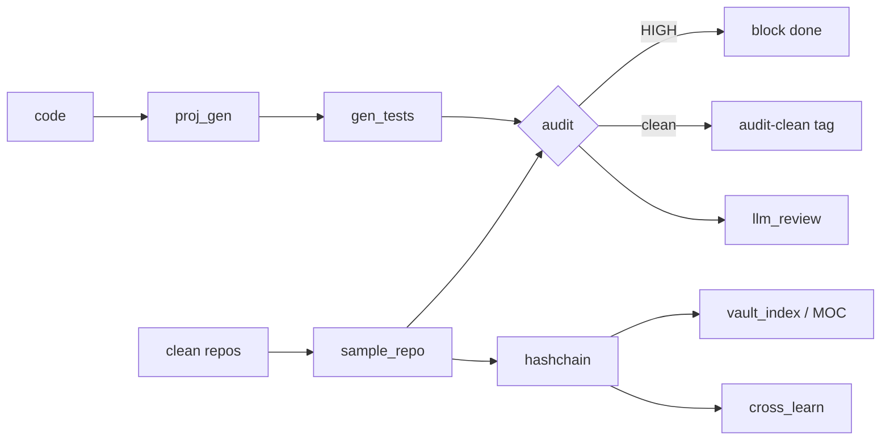

# 🐦 mincode-vuln-arch

> **Ship the least code needed. Modular. Audited. Remembered.**
> One toolkit, five ways to call it — from any AI agent or the CLI.

`mincode-vuln-arch` generates **minimal, modular, human-style code from scratch**,
**audits every project** for vulnerabilities, **mines clean architecture** from
real repos into reusable templates, and **persists findings** into a
tamper-evident **local hash-chain vault** (Obsidian optional).

**Zero external runtime dependencies** — everything runs on the Python standard
library. Optional `bandit` / `pip-audit` / an LLM key deepen coverage.

[](LICENSE)
[](https://www.python.org)
[](#)
[](#as-an-mcp-server)
[](#agent-agnostic)
[](https://github.com/Falcoraxyz/mincode-vuln-arch/actions)
[](https://github.com/Falcoraxyz/mincode-vuln-arch)

---

## ✨ Features

| #  | Capability            | Script            | What it does |
|----|-----------------------|-------------------|--------------|
| 1  | **Scaffold**          | `proj_gen.py`     | Minimal modular skeleton (`src/ tests/ docs/`), stdlib-first. Auto `git init` + `scaffold-<date>` tag. |
| 2  | **Audit**             | `audit.py`        | Heuristic vuln scan (+ optional `bandit`). CWE-tagged, A–F grade, dependency CVE scan (`pip-audit`). |
| 2b | **SARIF export**      | `audit.py`        | `--sarif out.sarif` (2.1.0) for GitHub code scanning; auto-uploaded by CI. |
| 2d | **HTML report**       | `audit.py`        | `--report out.html` (self-contained: severity colors, CWE links, grade badge). |
| 3  | **Mine architecture** | `sample_repo.py`  | Extract clean module boundaries + reusable snippets from any repo (human or AI-authored). |
| 3b | **Multi-language**    | `audit.py`        | Polyglot heuristic scan: Python + JS/TS/Go/Rust/sh, CWE-tagged. |
| 3c | **Arch auto-apply**   | `sample_repo.py`  | `--apply-arch` appends missing Architecture-Decision rows to `SKILL.md`. |
| 4  | **Gen tests**         | `gen_tests.py`    | `ast`-based generation — typed dummy args + `isinstance` assertions from return annotations. Zero-dep `unittest`. |
| 5  | **Hash-chain vault**  | `hashchain.py`    | Local, append-only, **HMAC-signed** notes — tamper-evident + forged-resistant. No network. |
| 6  | **Vault MOC**         | `vault_index.py`  | Auto-generated Obsidian Map of Content with `[[wikilinks]]` + CWE cross-links. |
| 7  | **Cross-project learn**| `cross_learn.py` | Aggregates recurring CWEs → `Common-Mistakes.md` + CI guardrail suggestions. |
| 8  | **LLM review**        | `llm_review.py`   | Logic-flaw review via OpenAI-compatible API; auto-detects Ollama/llama.cpp (offline) or OpenAI. No key → safe skip. |
| 9  | **Living arch table** | `sample_repo.py`  | Detects stacks in mined repos; flags missing rows in the decision table. |
| 10 | **Auto-git**          | `proj_gen`/`audit`| Tags `scaffold-<date>` / `audit-clean-<date>` — every green state is versioned. |
| 12 | **Config file**       | `config.py`       | Optional `mincode.toml` for vault path, audit skip-dirs/threshold, LLM model/base_url. |

---

## 📂 Layout

```
mincode-vuln-arch/
├── SKILL.md                 # AgentSkills-compatible skill: full workflow + decision table
├── AGENT.md                 # drop-in cheat-sheet for any AI agent
├── README.md  LICENSE
├── pyproject.toml          # pip-installable (mincode_vuln_arch + `mincode` console script)
├── build_pyz.py            # -> mincode.pyz single-file distribution
├── mincode.py              # single CLI dispatcher (delegates to scripts/cli.py)
├── mincode.toml.example    # config template
├── references/             # deep-dive docs (agentskills-spec, audit, tests, windows, gotchas)
├── scripts/                # all toolkit scripts (zero-dep)
│   ├── proj_gen.py          gen_tests.py        audit.py
│   ├── sample_repo.py       hashchain.py        vault_index.py
│   ├── cross_learn.py       llm_review.py       gen_ci.py
│   └── mcp_server.py        cli.py              config.py
└── vault/                   # Obsidian vault (hash-chained notes; created at runtime)
```

---

## 🚀 Quick start

Pick **one** install mode — they all wrap the same scripts.

<details open><summary><b>① Clone (full / dev)</b></summary>

```bash
git clone https://github.com/Falcoraxyz/mincode-vuln-arch
export OBSIDIAN_VAULT_PATH="$PWD/vault"   # optional, for vault output
```
</details>

<details><summary><b>② Pip-installable (global <code>mincode</code> command)</b></summary>

```bash
pip install .            # or: uv pip install .   /   uvx --from . mincode
mincode audit <project> --no-vault
mincode --help
```
No third-party dependencies. Installs as the `mincode_vuln_arch` package.
</details>

<details><summary><b>③ Single file (zero-install, any Python 3.8+)</b></summary>

```bash
python build_pyz.py                 # -> mincode.pyz (one self-contained file)
python mincode.pyz audit <project> --no-vault
```
Share `mincode.pyz` directly — no pip, no clone. Runs on any Python 3.8+ host.
</details>

<details><summary><b>④ MCP server (native tool for Claude Desktop / Cursor / Zed / Cline)</b></summary>

```bash
python scripts/mcp_server.py        # or: mincode mcp
```
Client config (`claude_desktop_config.json` / `mcp.json`):
```json
{ "mcpServers": { "mincode": {
    "command": "python",
    "args": ["/path/to/mincode-vuln-arch/scripts/mcp_server.py"] } } }
```
Speaks MCP JSON-RPC (2024-11-05) over stdio, **zero dependencies**.
</details>

<details><summary><b>⑤ As a Hermes / AgentSkills skill</b></summary>

Drop (or symlink) the repo into your skills root — `SKILL.md` frontmatter is
AgentSkills-compatible, so any AgentSkills-aware loader picks it up directly:
```bash
ln -s "$PWD" ~/.hermes/skills/software-development/mincode-vuln-arch   # Hermes
ln -s "$PWD" ~/.claude/skills/mincode-vuln-arch                        # Claude Code
```
</details>

### Enable the audit gate in one command
```bash
mincode init .          # writes mincode.toml + .github/workflows/audit.yml
```
This scaffolds a CI workflow that runs `mincode audit . --sarif audit.sarif`
and **fails on HIGH findings**.

---

## 🔧 Usage

```bash
mincode gen <p>      # scaffold minimal project (auto git + tag)
mincode tests <p>    # generate typed smoke tests
mincode audit <p>    # vuln audit + graded CI gate (HIGH blocks "done")
mincode mine <repo>  # mine clean architecture patterns
mincode llm <p>      # LLM logic-flaw review (skips if no backend)
mincode vault <cmd>  # append / verify / diff / status
mincode moc          # rebuild Obsidian MOC
mincode learn        # aggregate recurring CWE
mincode ci <repo>    # generate CI gate workflow
mincode init <repo>  # one-shot: mincode.toml + CI into a repo
mincode mcp          # start MCP server (stdio)
```
All extra args pass through (`--vault`, `--no-vault`, `--sarif`, `--threshold`, …).
Vault defaults to `./mincode-vault` when `OBSIDIAN_VAULT_PATH` / `--vault` / `mincode.toml` are unset.

**Direct scripts (also fine):** `python scripts/audit.py myapp`, `python scripts/gen_tests.py myapp`, …

### Example audit output
```
AUDIT demo — 1 HIGH, 2 MED, 1 LOW
  HIGH  CWE-78  shell=True in src/cli.py:42        (eval/exec)
  MED   CWE-89  SQL string concat in src/db.py:17  (SQLi)
  MED   CWE-502 unsafe yaml.load in src/cfg.py:9    (deserialization)
  LOW   CWE-798 hardcoded API key in src/secret.py:3
GRADE: D  (penalty 36)   CWEs: {CWE-78, CWE-89, CWE-502, CWE-798}
```

---

## 🧠 How it works

```text
   code ──► proj_gen ──► gen_tests ──► audit ──► (llm_review)
                                    │
            sample_repo ◄── clean repos (human or AI)
                                    │
                          ┌─────────┴──────────┐
                     hashchain.py          vault_index.py
                  (HMAC-signed ledger)    (Obsidian MOC)
                          │                    │
                     cross_learn.py ◄──────────┘
                  (Common-Mistakes.md, guardrails)
                          │
                   persistent memory (permanent)
```



The vault is a **local hash-chain** — each note links to the previous note's
hash and is **HMAC-signed** with a per-vault key. Editing a note *or* the ledger
together is caught on `verify`. This is tamper-evident + forged-resistant, **not**
a distributed ledger — no network required.

---

## 🏗️ Architecture decision table

The skill picks the **optimal + stable + newest usable** stack per concern.
Full table lives in [`SKILL.md`](SKILL.md); `sample_repo.py` checks mined repos
against it and suggests new rows.

| Stack | Pick |
|-------|------|
| CLI | stdlib + argparse |
| Web API | FastAPI (or stdlib `http.server` if tiny) |
| Data / ETL | Python modules + pydantic |
| Frontend | Vite + vanilla TS / Svelte |
| Long-running svc | supervisor, config via env |
| Storage | SQLite (Postgres only if scale demands) |

---

## 🤖 Agent-agnostic

This toolkit is designed to be called by **any** agent, not just Hermes:

| Integration | How | Best for |
|-------------|-----|----------|
| **AgentSkills** | `SKILL.md` in a skills dir | agents with a skill system |
| **MCP** | `python scripts/mcp_server.py` | Claude Desktop / Cursor / Zed / Cline native tools |
| **CLI** | `python mincode.py <cmd>` | shell-based agents / humans |
| **pip/uvx** | `pip install .` → `mincode` | global install, any agent |
| **pyz** | `python mincode.pyz <cmd>` | single-file, zero-install, air-gapped |

No hardcoded paths. Zero third-party dependencies. See [`AGENT.md`](AGENT.md)
for a copy-paste cheat-sheet and [`references/agentskills-spec.md`](references/agentskills-spec.md)
for the compatibility contract.

---

## 📌 Notes & limits

- Audit is **heuristic** — a clean scan is not a guarantee. `llm_review.py`
  covers logic blind spots when a model endpoint is available.
- `pip-audit` (dep CVEs) and `bandit` are optional install/network extras.
- The hash-chain is **local** tamper-evidence, not a blockchain. Never commit
  the HMAC key (`vault/._chain/.key` is gitignored).
- Run generated tests with `python tests/<mod>_test.py` (reliable on Windows;
  `unittest discover` can report 0 in some envs).

---

## 🗺️ Roadmap

All original ideas + the portability track have shipped. Status snapshot in
[`ROADMAP.md`](ROADMAP.md).

---

## 📄 License

[Apache-2.0](LICENSE) © Falcoraxyz
